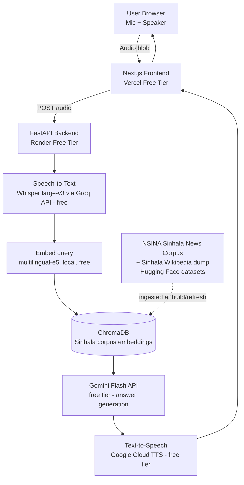
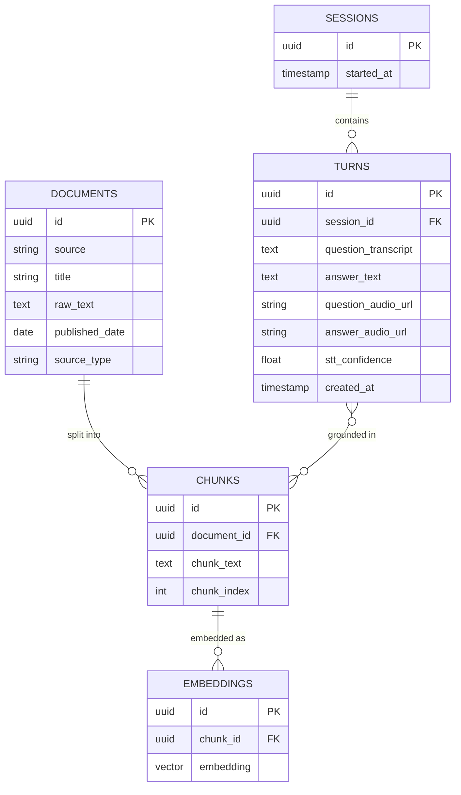
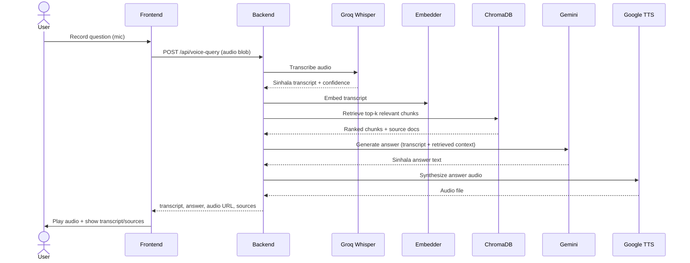
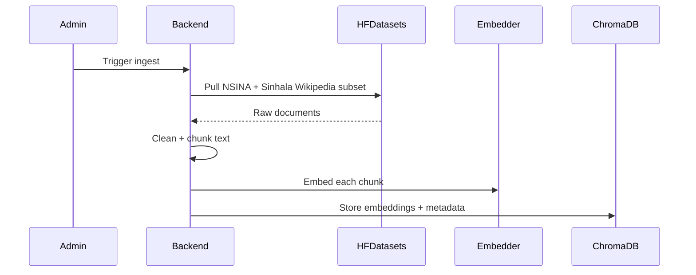

# Sinhala Voice Assistant (RAG) — Full Project Documentation (v1.0)

> Scope: general Sinhala Q&A (news + encyclopedic knowledge), full voice in/out from day one, free-tier only. This is a genuinely hard MVP — Sinhala is a confirmed low-resource language for both speech and text AI, so several sections below manage that risk explicitly rather than pretending it away.

---

## 1. Executive Summary

**Problem:** Sinhala speakers have almost no working voice-AI assistant to talk to in their own language — research confirms Sinhala remains under-resourced across speech, transcription, and generation, despite 17M+ speakers. Existing "AI assistants" either don't support Sinhala at all or handle it as an afterthought with poor quality.

**Solution:** A web app where a user speaks a question in Sinhala, the system transcribes it, retrieves relevant facts from a Sinhala knowledge base (news + Wikipedia), generates a Sinhala answer, and speaks it back — a full voice-in/voice-out RAG assistant.

**Goals (MVP):**
- Accept spoken Sinhala input via browser microphone
- Transcribe accurately enough to be usable (imperfect Sinhala STT is expected and will be documented, not hidden)
- Retrieve grounded answers from a real Sinhala corpus (not just the LLM's raw, often-weak Sinhala knowledge)
- Speak the answer back in natural-sounding Sinhala
- Run entirely on free-tier infrastructure

**Non-Goals (MVP):**
- Real-time streaming conversation (turn-based voice Q&A is the MVP; continuous conversation is a stretch goal)
- Supporting code-switched Singlish (romanized Sinhala) input — flagged as Phase 2, see Section 15
- Matching English-assistant-grade accuracy — Sinhala STT/TTS quality is a known, documented limitation, not a bug to "fix" in v1

---

## 2. Functional Requirements

| ID | Requirement | Priority |
|----|---|---|
| FR-1 | User shall be able to record a spoken Sinhala question via browser microphone | MVP |
| FR-2 | System shall transcribe the Sinhala audio to text | MVP |
| FR-3 | System shall embed the transcribed query and retrieve relevant chunks from the Sinhala knowledge corpus | MVP |
| FR-4 | System shall generate a grounded Sinhala-language answer using retrieved context | MVP |
| FR-5 | System shall convert the answer text to spoken Sinhala audio and play it back | MVP |
| FR-6 | System shall display the transcript (question + answer) as text alongside the audio, for transparency and accessibility | MVP |
| FR-7 | System shall show which source document(s) an answer was grounded in | MVP |
| FR-8 | User shall be able to type a question instead of speaking, as a fallback | MVP |
| FR-9 | System shall periodically refresh its news corpus so answers aren't frozen at build time | Phase 2 |
| FR-10 | System shall support romanized Sinhala ("Singlish") input via transliteration before STT/embedding | Phase 2 |
| FR-11 | System shall support continuous multi-turn voice conversation (not just single Q&A turns) | Phase 3 |
| FR-12 | System shall flag/filter offensive or unsafe queries before generating a response | Phase 2 |

---

## 3. Non-Functional Requirements

- **Accuracy expectations (explicit, not aspirational):** Sinhala is a confirmed low-resource language in speech and text AI research. Whisper's Sinhala word-error-rate is meaningfully higher than English. This must be stated plainly in the README as a known limitation — framing it honestly ("first open attempt at X for Sinhala, with documented accuracy limits") reads as more credible to a technical reviewer than silently shipping something that sometimes mistranscribes and never explaining why.
- **Latency:** End-to-end voice round trip (record → transcribe → retrieve → generate → speak) target under 8 seconds on free-tier APIs. Turn-based, not real-time — set this expectation in the UI (a visible "thinking" state), not just in code.
- **Cost:** $0/month target, matching Groq/Google free-tier quotas.
- **Data grounding:** Every answer must cite which source chunk(s) it came from — critical for a knowledge assistant, and it's also the easiest way to catch and show hallucination in a low-resource-language setting where you can't just "trust the model's fluency" the way you might in English.
- **Content safety:** Sinhala offensive-language detection is itself an active, unsolved research problem (existing detectors, including major commercial ones, are documented to perform poorly on Sinhala). MVP uses a conservative, simple keyword/heuristic filter and documents this as a known gap rather than claiming robust moderation it doesn't have.

---

## 4. System Architecture



**Why these specific choices (this is the part that differs from a normal RAG build):**
- **STT — Groq's hosted Whisper large-v3**, not self-hosted: Whisper does support Sinhala, but running large-v3 well needs a GPU you don't have for free. Groq hosts it and gives you free, fast inference — and you already have Groq credentials from your other projects.
- **LLM — Gemini Flash (free tier via AI Studio), not Groq/Llama 3:** Llama 3's official language support doesn't meaningfully include Sinhala; Gemini has materially better multilingual generation quality for lower-resource languages like Sinhala. This is a deliberate deviation from your usual Groq-only stack, and worth explaining exactly this way in an interview — you chose the tool that fit the language, not the tool you'd already used.
- **Embeddings — multilingual-e5 (local, free) instead of Sinhala-specific:** no free, production-ready Sinhala-only embedding model exists yet; a good multilingual model is the practical choice today. Note this as a "current best option, revisit if a dedicated Sinhala embedding model matures" — showing that judgment explicitly is a good signal.
- **Corpus — NSINA (Sinhala news corpus) + Sinhala Wikipedia dump**, both real, citable, freely available research datasets on Hugging Face — not scraped, not invented.

---

## 5. Tech Stack

| Layer | Technology | Why | Alternatives Considered |
|---|---|---|---|
| Frontend | Next.js + TypeScript + Tailwind, `MediaRecorder` API for mic capture | Free Vercel hosting, browser-native audio recording needs no extra library | React Native (unnecessary for a web MVP) |
| Backend | FastAPI | Consistent with your other projects | — |
| STT | Groq API — Whisper large-v3 | Free tier, fast, hosted (no local GPU needed) | Self-hosted `faster-whisper` (free but slow/heavy on Render's free CPU tier) |
| LLM (generation) | Google Gemini Flash (free tier, AI Studio) | Meaningfully better Sinhala generation quality than Llama 3 | Groq/Llama 3 (weaker Sinhala support), SinLlama (research model — see Section 15 stretch goal) |
| Embeddings | `intfloat/multilingual-e5-large` via `sentence-transformers` (local) | Free, decent multilingual coverage including Sinhala, runs on CPU | LaBSE (also viable, slightly different tradeoffs) |
| Vector store | ChromaDB (embedded, file-based) | Free, matches your existing RAG chatbot approach | — |
| TTS | Google Cloud TTS (free tier — check current free character quota at build time) | Confirmed Sinhala voice support | Browser-native `SpeechSynthesis` API (inconsistent/absent Sinhala voice support across OS/browsers — don't rely on it) |
| Corpus source | NSINA Sinhala News Corpus, Sinhala Wikipedia (HF datasets) | Real, free, research-grade, citable | Live scraping (unnecessary — static corpora are enough for an MVP knowledge base) |
| Hosting (frontend) | Vercel free tier | — | — |
| Hosting (backend) | Render free tier | — | — |

**Build-time verification task (do this in Phase 0, not later):** Google Cloud TTS's free tier and exact Sinhala voice list can change — confirm current quota and voice availability before committing to it as the TTS provider, and have Azure Neural TTS (also reported to support Sinhala) as a documented fallback if Google's terms have shifted.

---

## 6. Data Model



`stt_confidence` on `TURNS` matters here specifically — surfacing it in the UI ("I heard: ... [low confidence]") is an honest, low-effort way to handle Sinhala STT's known accuracy limits instead of silently guessing wrong.

---

## 7. API Design

| Method | Path | Purpose | Request | Response |
|---|---|---|---|---|
| POST | `/api/voice-query` | Full pipeline: audio in → answer out | multipart audio file | `{transcript, answer_text, answer_audio_url, sources[], stt_confidence}` |
| POST | `/api/text-query` | Text fallback (FR-8) | `{question: string}` | `{answer_text, answer_audio_url, sources[]}` |
| GET | `/api/corpus/status` | When was the corpus last refreshed | — | `{last_refreshed, document_count}` |
| POST | `/api/corpus/refresh` | Manually trigger corpus re-ingest (admin/dev) | — | `{ingested_count}` |

**Sample `/api/voice-query` response:**
```json
{
  "transcript": "[Sinhala transcript text]",
  "answer_text": "[Sinhala answer text]",
  "answer_audio_url": "https://.../answer_a1b2.mp3",
  "sources": [{"title": "...", "source": "NSINA", "published_date": "2026-06-01"}],
  "stt_confidence": 0.71
}
```

---

## 8. Core Flows

### 8.1 Voice Query — End to End



### 8.2 Corpus Ingestion (build-time / scheduled refresh)



---

## 9. Component/Module Breakdown

```
sinhala-voice-assistant/
├── frontend/
│   ├── app/
│   │   ├── page.tsx                # Mic recorder + text fallback UI
│   │   └── components/
│   │       ├── VoiceRecorder.tsx
│   │       ├── TranscriptView.tsx
│   │       └── SourcesPanel.tsx
├── backend/
│   ├── main.py
│   ├── routers/
│   │   ├── voice_query.py
│   │   └── corpus.py
│   ├── services/
│   │   ├── stt.py                  # Groq Whisper wrapper
│   │   ├── tts.py                  # Google Cloud TTS wrapper
│   │   ├── retriever.py            # Embedding + ChromaDB query
│   │   ├── generator.py            # Gemini prompt + call
│   │   └── corpus_ingest.py        # HF dataset pull + chunk + embed
│   ├── models/                     # Matches Section 6
│   └── db.py
├── data/
│   └── corpus_cache/               # Local cache of ingested source docs
├── tests/
└── .github/workflows/ci.yml
```

Same single-responsibility principle as before: `stt.py` only transcribes, `retriever.py` only retrieves, `generator.py` only generates — this matters more here than usual, because when quality is inconsistent (expected, given the language), being able to isolate *which stage* introduced an error is essential for debugging and for writing an honest evaluation in your README.

---

## 10. Edge Cases & Failure Handling

| Scenario | Expected Behavior | Handling |
|---|---|---|
| Low-confidence transcription | Show transcript with a visible low-confidence flag, let user confirm/retry before generating an answer | Threshold on Whisper confidence score; UI prompts "Did I hear that right?" below threshold |
| No relevant chunks retrieved | Answer honestly says it doesn't have grounded information, doesn't hallucinate a confident-sounding answer | Similarity threshold on retrieval; below it, return a fixed "I don't have information on this" Sinhala response instead of calling the LLM blind |
| Romanized/Singlish input spoken or typed | Out of scope for MVP — detect and show a clear message rather than silently failing | Simple heuristic (Latin-script ratio) on input text triggers a "Sinhala script only for now" message |
| TTS free-tier quota exhausted | Fall back to text-only response with a visible notice, not a broken/silent failure | Catch quota-exceeded errors explicitly, degrade gracefully |
| Corpus is stale (old news) | Every answer that's news-derived shows its source's published date, so staleness is visible, not hidden | `published_date` always surfaced in the sources panel (FR-7) |
| Offensive/unsafe query | Basic heuristic filter declines to answer with a neutral message, logged for later review (not auto-published/handled at research-grade accuracy — documented as a known limitation) | Simple keyword/heuristic layer before hitting the LLM |
| Microphone permission denied | Text input fallback (FR-8) is always visible, not hidden behind a broken mic flow | Frontend detects permission failure, surfaces text input immediately |

---

## 11. Security & Ethical Considerations

- **API keys** (Groq, Gemini, Google Cloud TTS) in environment variables only, never committed.
- **Audio storage:** store only as long as needed to serve the response; don't build a permanent voice-data archive without a clear reason and disclosure — voice recordings are more sensitive than text.
- **Corpus licensing:** NSINA and the Sinhala Wikipedia dump are research-released datasets — check and state their specific license terms in your README before any public/production use beyond a personal portfolio demo.
- **Honesty about limitations:** given that Sinhala offensive-language detection and general NLP accuracy are active open research problems (documented in multiple recent papers), the single most credible thing you can do is state your system's known failure modes explicitly in the README rather than implying production-grade reliability it doesn't have. Reviewers with any NLP background will recognize honest limitation-reporting as a stronger signal than an oversold claim.

---

## 12. Testing Strategy

| Feature | Test Cases |
|---|---|
| STT pipeline | Clear audio → transcript within expected WER range (benchmark against a small hand-labeled sample you record yourself); silent/empty audio → clean error, not a crash |
| Retrieval | Query clearly covered by corpus → relevant chunks returned; query totally unrelated to corpus → empty/low-similarity result triggers the "no information" path, not a hallucinated answer |
| Generation | Answer only uses retrieved context (spot-check a sample manually — for a low-resource language, automated faithfulness metrics like Ragas are less reliable, so manual review matters more here than in an English RAG project) |
| TTS | Generated audio is non-empty and playable; quota-exceeded path degrades to text, doesn't crash |
| End-to-end | Full voice round trip on 10 hand-picked real Sinhala questions, manually graded for transcript accuracy + answer relevance — this manual eval set is itself something to show in your README as evidence of rigor |

**Tools:** `pytest` + `httpx` for backend, a small hand-curated Sinhala test-question set (build this yourself — this doubles as a genuinely useful artifact for your portfolio, since almost no public Sinhala QA eval sets exist).

---

## 13. Deployment Plan — Free Tier Steps

1. **Backend (Render):** same pattern as before — web service, env vars for Groq/Gemini/Google Cloud keys, free-tier cold start caveat documented in README.
2. **Frontend (Vercel):** Next.js app, `NEXT_PUBLIC_API_URL` pointing at Render backend. Note: mic access (`getUserMedia`) requires HTTPS — Vercel's default domain covers this automatically.
3. **Google Cloud TTS setup:** enable the Text-to-Speech API in a free Google Cloud project, create a service-account key, confirm current free-tier character quota (verify at build time — quotas and terms change).
4. **Gemini API:** get a free API key from Google AI Studio.
5. **Groq API:** reuse your existing Groq account/key from prior projects for Whisper access.
6. **Corpus ingestion:** run once at deploy time (or via a manual admin endpoint) to pull NSINA + Sinhala Wikipedia subset from Hugging Face and populate ChromaDB — this can run locally and ship the resulting Chroma files with the deploy, avoiding repeated ingestion costs on every redeploy.
7. **CI:** GitHub Actions running `pytest` on push, same as prior projects.

---

## 14. Build Roadmap / Phases

### Phase 0 — Setup + Feasibility Check (do this before anything else)
- Confirm Groq Whisper actually transcribes Sinhala at usable quality on a handful of real recordings — this is the single riskiest assumption in the whole project. If quality is too poor to be usable, that's a Phase 0 finding, not a Phase 2 surprise.
- Confirm Google Cloud TTS Sinhala voice availability and free quota.
- Small corpus ingestion test (few hundred documents) end-to-end.

### Phase 1 — MVP Core (FR-1 to FR-8)
- Full voice round trip working on a modest corpus subset.
- Text fallback, source citation, confidence display.
- **Deliverable:** a working, deployed voice assistant you can demo live in an interview.

### Phase 2 — Robustness (FR-9, FR-10, FR-12)
- Scheduled corpus refresh.
- Singlish/romanized input handling.
- Better content-safety filtering.

### Phase 3 — Stretch / Differentiation
- Multi-turn conversation (FR-11).
- Evaluate whether fine-tuning a small open model on Sinhala Q&A (e.g. building on research like SinLlama) is worth attempting — this would be the single strongest differentiator in the whole project if you have time, since it moves you from "used an API well" to "adapted a model for an underserved language," which is a materially different and rarer claim.

---

## 15. Open Questions / Assumptions Made

1. **`[ASSUMPTION]`** Corpus scope is "general Sinhala Q&A" via NSINA news + Wikipedia — if you'd rather narrow to a single domain (e.g. only current-events news, or only encyclopedic facts), the retrieval/eval design gets simpler and answer quality likely improves; confirm before Phase 1.
2. **`[RISK, not just assumption]`** Voice-first-from-day-one is the ambitious choice you picked — the real risk isn't building it, it's that Whisper's Sinhala transcription quality might be too inconsistent to feel "impressive" in a live demo. Phase 0's feasibility check exists specifically to catch this early; if quality is rough, consider demoing with a curated set of clearly-spoken sample questions rather than fully live, unscripted mic input for interviews.
3. Should offensive-query filtering (FR-12) be pulled into MVP given how directly it affects whether this is safe to show publicly, or is Phase 2 timing acceptable for a portfolio-only demo?
4. Do you want the corpus fixed at build time (simpler, static demo) or actually live-refreshing on a schedule (FR-9, more impressive but adds a scheduled job dependency)?

---

## Appendix A: Google Antigravity Build Setup

### Skills to install
- **`frontend-design`** — the mic-recorder UI (recording state, waveform/listening indicator, low-confidence transcript flag, sources panel) needs to feel intentional, not like a bare `<input type="file">` demo. This matters more than usual here since the UI is *carrying* some of the honesty work (surfacing confidence scores, source dates) that this project's design leans on.
- **`coding-agent`** (or your general backend skill) — for the FastAPI voice pipeline sessions.
- Install via the Agent panel: `antigravity skill frontend-design`, confirm, repeat as needed. Don't bulk-install skills unrelated to this project (audio/voice work doesn't need e.g. Stripe or Slack skills sitting in the tool list).

### MCP servers to connect
| MCP | Purpose in this project |
|---|---|
| **GitHub MCP** | Auto-branch per roadmap item, auto-commit, open PRs — same workflow as your other projects |
| **Context7 MCP** | Keeps FastAPI, `sentence-transformers`, ChromaDB, and the Google Gemini/Cloud TTS SDKs current in context — worth enabling specifically here since the Google Cloud TTS and Gemini SDKs are less commonly used than OpenAI's, so a model's baseline training knowledge of their exact current API shape is shakier |
| **Browser MCP** | Enable only when testing the mic-recording flow manually (`getUserMedia` behavior is easiest to sanity-check by literally watching a browser tab) — disable it the rest of the time |

There isn't a strong case for a Supabase/database MCP here since this project has no user accounts or Postgres layer (Section 6's data model is served entirely by ChromaDB + local files) — skip installing one just because you used it last project.

### Branch & commit rules — `.antigravity/AGENTS.md`
```markdown
# Branch & Commit Rules — Sinhala Voice Assistant

- One feature branch per roadmap item in Section 14, named `feature/{phase}-{short-name}`
  e.g. `feature/p0-whisper-feasibility-check`, `feature/p1-voice-pipeline`,
       `feature/p1-corpus-ingest`, `feature/p2-singlish-detection`
- Phase 0's feasibility check (Whisper Sinhala quality, TTS voice availability) must be
  its own branch/PR with the actual test recordings and results committed — this is a
  finding to document, not just a step to complete silently.
- Commit messages: conventional commits style (`feat:`, `fix:`, `test:`, `docs:`, `data:` for corpus/ingestion changes)
- Never commit real API keys, service-account JSON files, or user-recorded audio samples
  containing anyone else's voice to the repo — .env and any /data/audio_samples/ path
  must be in .gitignore from the very first commit
- Every PR must state: what changed, why, and — for anything touching STT/TTS/generation —
  what the observed quality looked like on a few manual test cases (this project's testing
  strategy in Section 12 leans on manual review more than most, so make that visible in PRs too)
```

### Suggested first prompt to the agent
> "Set up the project structure from Section 9 of Sinhala-Voice-Assistant-SDLC.md. Start with Phase 0 only: a minimal script that records/accepts a Sinhala audio sample, sends it to Groq's Whisper API, and prints the transcript and confidence. Don't build the frontend or retrieval pipeline yet — this is purely to test transcription quality before committing to the rest of the architecture. Branch: `feature/p0-whisper-feasibility-check`."

Feeding it Phase 0 in isolation like this — rather than "build the whole app" — matters more for this project than your others, since the entire architecture in Sections 4-9 is conditional on that feasibility check passing. Let the agent (and you) see real results before generating code for stages that assume it will.

### Practical tip
Drop this whole document in the repo root before starting, same as your other projects — but specifically call out Section 15's open risk (item 2) in your first prompt to the agent, so it doesn't quietly assume perfect STT quality while scaffolding the retrieval and generation stages around it.

---

## Appendix B: Why This Project Is Worth the Extra Difficulty

Compared to your other projects, this one is harder and slower to build — voice pipelines have more moving parts than a text chatbot, and Sinhala's low-resource status means you can't assume any component "just works" the way it would in English. That difficulty is exactly what makes it worth including: it's the one project on your CV where the story isn't "I called an LLM API," it's "I identified a real gap, understood *why* the standard tools underperform here, and made specific, defensible engineering choices to work around it." That's a fundamentally different interview conversation than any of your other projects currently support.
